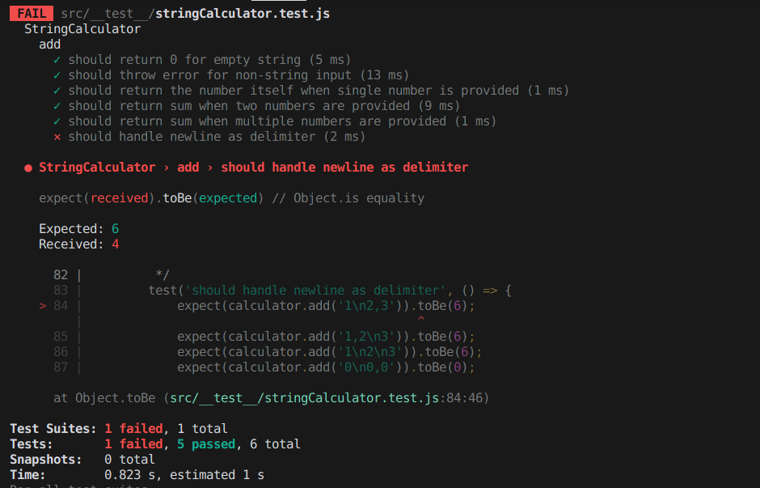
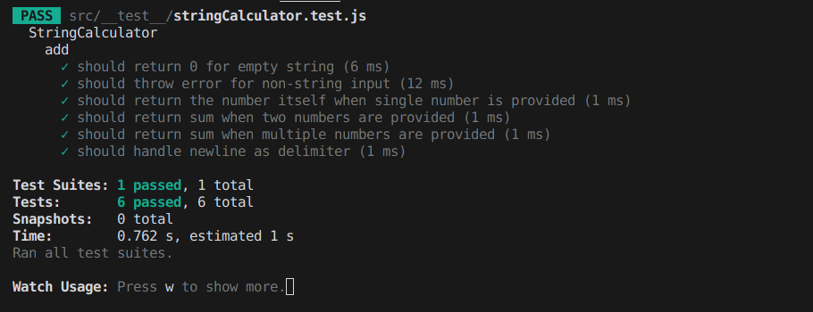
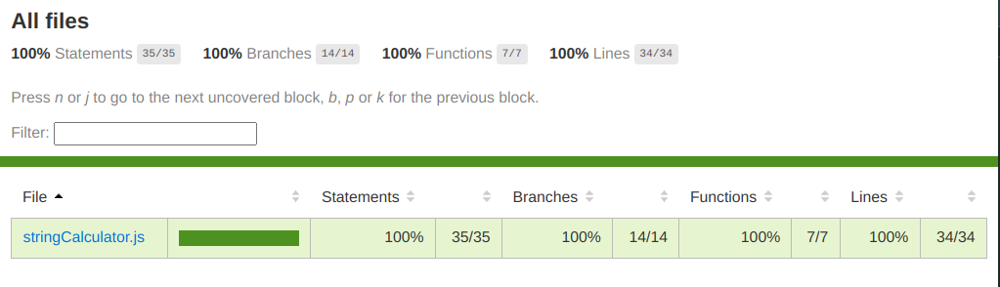

# String Calculator TDD Kata

## Overview
This project implements the String Calculator Kata following Test-Driven Development (TDD) principles. It's a step-by-step process of building a calculator that handles string inputs with various delimiters.

## Problem Statement
You can find the problem statement at the following link:
[https://osherove.com/tdd-kata-1/](https://osherove.com/tdd-kata-1/)

## What is TDD?
Test-Driven Development (TDD) is a software development approach that emphasizes writing tests before writing the actual implementation. It follows a simple **Red-Green-Refactor** cycle:

1. **Red** - Write a failing test that defines the expected behavior.
2. **Green** - Implement the minimal amount of code needed to make the test pass.
3. **Refactor** - Improve the code while ensuring all tests continue to pass.

By following this cycle, TDD helps developers create well-structured, maintainable, and bug-free code.

## Features
- Empty string returns `0`
- Single number returns the number itself
- Two numbers separated by a comma return their sum
- Handles multiple numbers
- Supports newline as a delimiter
- Supports custom delimiters
- Supports multiple delimiters
- Supports multi-character delimiters
- Validates negative numbers
- Ignores numbers larger than `1000`

## TDD Process Screenshots
1. **Initial failing test for empty string input**



2. **Tests passing after implementing basic functionality**



More reference images can be found in the [TDD Step - Red](https://github.com/parasdalsaniya/string-calculator-tdd-kata/tree/master/docs/images) directory.


## Project Structure

```
string-calculator-kata/
├── package.json          # Project dependencies and scripts
├── package-lock.json     # Locked versions of dependencies
├── README.md             # Project documentation (you're reading it)
├── requirement.txt       # Original kata requirements
└── src/                  # Source code directory
    ├── stringCalculator.js   # Main calculator implementation
    └── test/                 # Test files directory
        └── stringCalculator.test.js  # Test suite
```

## Setup Instructions

1. **Clone the repository**
   ```bash
   git clone git@github.com:parasdalsaniya/string-calculator-tdd-kata.git
   cd string-calculator-kata
   ```

2. **Install dependencies**
   ```bash<repository-url>
   npm install
   ```

3. **Run tests**
   ```bash
   # Run tests in watch mode
   npm test
   
   # Run tests with coverage
   npm run test:coverage
   
   # Run tests with coverage in watch mode
   npm run test:coverage:watch
   ```

## Test Cases Examples

```javascript
// Basic cases
add("") // Returns 0
add("1") // Returns 1
add("1,2") // Returns 3

// Custom delimiter
add("//;\n1;2") // Returns 3

// Multiple delimiters
add("//[][%]\n12%3") // Returns 6

// Multi-character delimiters
add("//[][%%]\n12%%3") // Returns 6
```

## Implementation Steps (TDD)
1. Return `0` for an empty string
2. Return the number for a single number
3. Add two comma-separated numbers
4. Handle multiple numbers
5. Support newline as a delimiter
6. Support custom delimiters
7. Throw an error for negative numbers
8. Ignore numbers greater than `1000`
9. Support multiple delimiters
10. Support multi-character delimiters

## Key Outcomes
- **Initial Test Suite:** Writing test cases before implementation
- **Failed Test Cases:** Ensuring initial tests fail (Red phase)
- **Code Implementation:** Writing the minimal required code to pass tests
- **Refactoring Process:** Improving code quality while keeping tests green
- **Test Execution and Validation:** Running tests to confirm correctness
- **All Tests Passed:** Ensuring complete functionality before finalizing

## Code Coverage
To view code coverage:
1. Run `npm run test:coverage`
2. Open `coverage/lcov-report/index.html` in your browser

**Current coverage: 100% across all files**



## Clean Code Principles Applied
- **Single Responsibility Principle**
- **Clear naming conventions**
- **Private methods using `#` prefix**
- **Comprehensive error handling**
- **Well-documented code**
- **Small, focused methods**
- **Test-driven development**
- **Consistent formatting**

## Requirements
- Node.js `>= 14.x`
- npm `>= 6.x`
